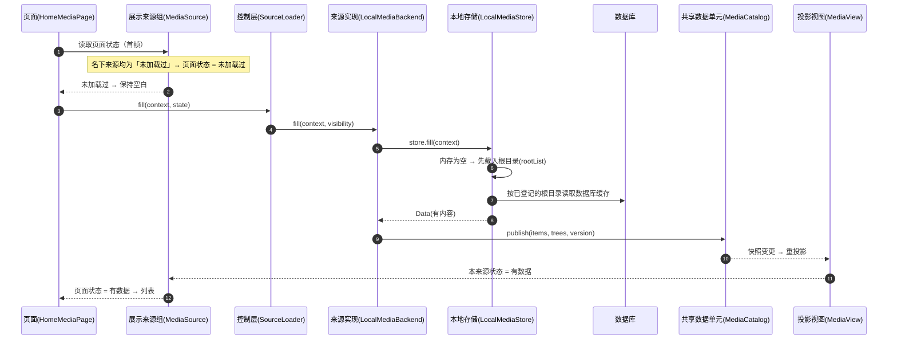
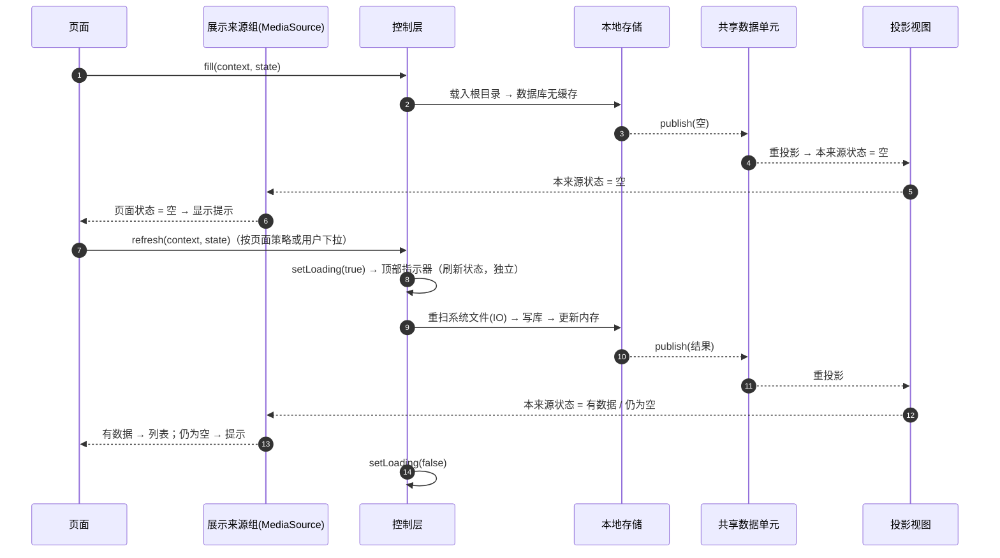
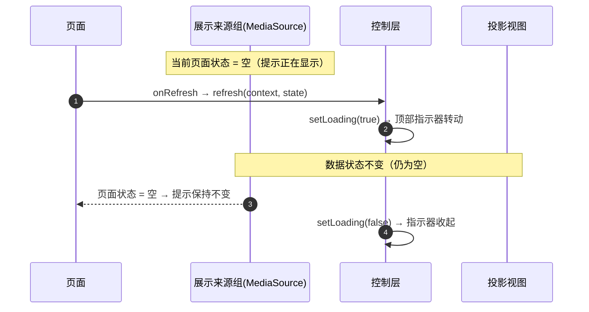
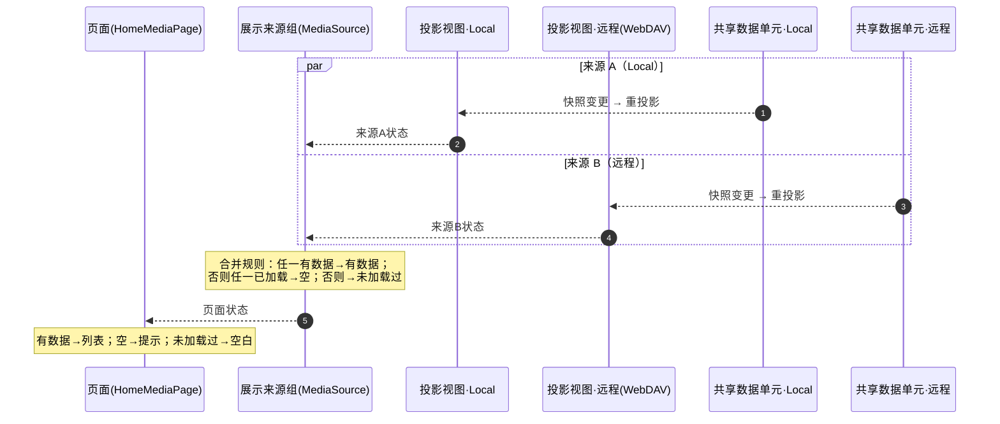
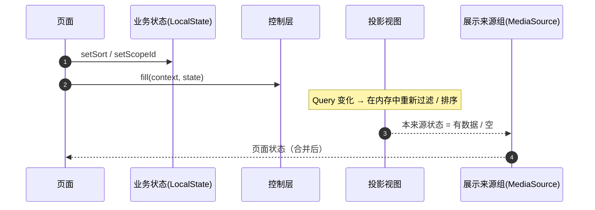
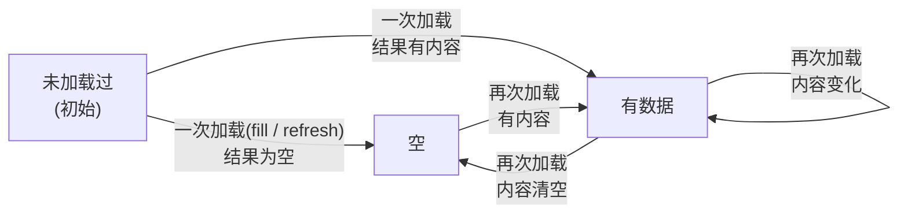
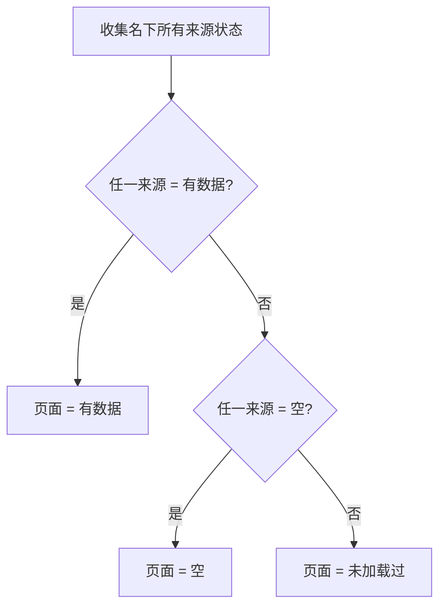
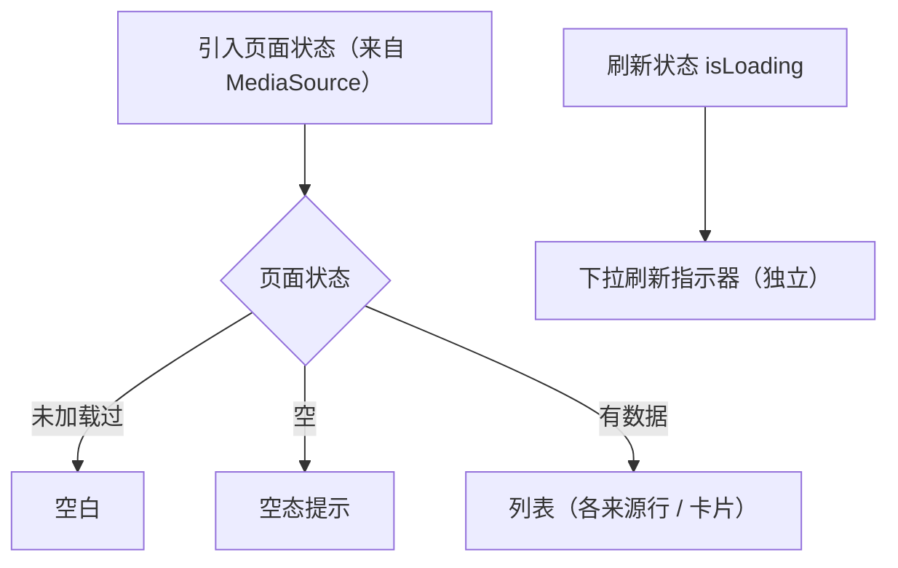

# MediaFlow 数据加载与状态设计

> 本文是**梳理后的目标逻辑**：加载操作如何划分、数据状态如何建模、**多来源如何合并**、UI 如何判定。
> 只描述应当成立的逻辑，不复述当前代码中的问题实现。

---

## 一、分层

数据自下而上流经以下层，每层只对上一层负责：

| 层 | 类型 | 职责 |
|---|---|---|
| 本地存储 | [`LocalMediaStore`](app/src/main/java/com/lollipop/mediaflow/data/local/LocalMediaStore.kt:32)（`Public` / `Private` 两个 object） | 按 `visibility` 隔离的内存缓存，并调度数据库读写；用锁做并发合并。**不区分 mediaType / 排序 / 范围**。 |
| 文件读取 | [`LocalMediaLoader`](app/src/main/java/com/lollipop/mediaflow/data/local/LocalMediaLoader.kt:24) | 真正的 IO：通过 `DocumentsContract` / ContentProvider 跨进程读取系统文件并建树。 |
| 数据库缓存 | [`LocalMediaProvider`](app/src/main/java/com/lollipop/mediaflow/data/local/LocalMediaProvider.kt:14) / [`MediaDatabase`](app/src/main/java/com/lollipop/mediaflow/data/local/MediaDatabase.kt) | 拍平存库、按 `visibility` 读回、根目录（rootUri）读写。 |
| 来源实现 | [`LocalMediaBackend`](app/src/main/java/com/lollipop/mediaflow/data/local/LocalMediaBackend.kt:23) `: MediaBackend` | 把本地存储的产出拍平后**发布**进共享数据单元。**每个来源一个实现**（Local / WebDAV / …）。 |
| 共享数据单元 | [`MediaCatalog`](app/src/main/java/com/lollipop/mediaflow/data/source/MediaCatalog.kt:21) | 分区键 = `(sourceId, visibility)`；持有 [`MediaSnapshot`](app/src/main/java/com/lollipop/mediaflow/data/source/MediaSnapshot.kt:14) 的 `State`；**只有来源实现能写**。 |
| 投影视图 | [`MediaView`](app/src/main/java/com/lollipop/mediaflow/data/source/MediaView.kt:36) | 从共享数据单元派生：按 `scope + mediaType` 过滤、按 `sort` 排序；**每个来源各一份**。 |
| 展示来源组 | [`MediaSource`](app/src/main/java/com/lollipop/mediaflow/data/MediaSource.kt:23) | 面向 UI：分区 = `(visibility, mediaType)`，内部持有该分区下**所有来源**的投影视图，并**聚合各来源状态**为页面状态。 |
| 控制层 | [`SourceLoader`](app/src/main/java/com/lollipop/mediaflow/data/SourceLoader.kt:23)（`object Local`） | 编排 `fill / refresh / loadMore`，合并并发请求，翻转刷新状态与错误状态。 |
| 状态契约 | [`SourceState`](app/src/main/java/com/lollipop/mediaflow/data/SourceState.kt:16) / [`LocalState`](app/src/main/java/com/lollipop/mediaflow/data/local/LocalState.kt:20) | 单个来源的业务状态：`sort / scopeId / isLoading / error`。 |
| UI | [`HomeMediaPage`](app/src/main/java/com/lollipop/mediaflow/ui/home/HomeMediaPage.kt:118) | 只观察 [`MediaSource`](app/src/main/java/com/lollipop/mediaflow/data/MediaSource.kt:23) 聚合出的**页面状态**，以及刷新状态，组合出列表 / 空态 / 下拉指示器。 |

### 两条数据维度

- **来源轴（多来源合并）**：同一分区下可挂多个来源（Local、WebDAV、…）。每个来源有各自的共享数据单元与投影视图，最终由 [`MediaSource`](app/src/main/java/com/lollipop/mediaflow/data/MediaSource.kt:23) 合并成一个页面。
- **视图轴（同源多视图）**：同一份来源数据（共享数据单元）被 `mediaType / sort / scopeId` 切成多个视图——视频与图片共享同一份原始数据，却各自独立。

```
共享数据单元 = (sourceId, visibility)              ← 同来源、同可见性共享一份原始数据
投影视图     = 共享数据单元 + MediaQuery(mediaType, sort, scopeId)
展示来源组   = (visibility, mediaType)              ← UI 的分区，聚合该分区下「所有来源」的投影视图
```

---

## 二、加载操作

| 操作 | 语义 | 「加载」的含义 | 是否翻 `isLoading` |
|---|---|---|---|
| `fill` | 把**已缓存**的数据投影进展示层：内存优先，缺失则读数据库。 | 从**缓存 / 数据库**加载 | 否 |
| `refresh` | **彻底刷新**：走 IO 跨进程重扫系统文件，写回数据库与内存。 | 从**系统文件**加载 | 是 |
| `loadMore` | 仅针对有分页 / 懒加载的来源（WebDAV）。Local 无此概念。 | 增量加载 | 否 |

要点：

- `fill` 与 `refresh` **都属于「加载」**，差别只在数据来源与代价——不是「只有 refresh 才算加载」。
- `fill` 负责快速把已有结果呈上来；`refresh` 负责把数据刷新到最新。

---

## 三、数据状态

### 3.1 用数据本身表示状态

共享数据单元的 [`MediaSnapshot`](app/src/main/java/com/lollipop/mediaflow/data/source/MediaSnapshot.kt:14) 有三种取值，直接承载状态，不需要另造类型：

| 取值 | 含义 | 性质 |
|---|---|---|
| 「未加载」对象 | 还没有加载过 | 正常（等待加载） |
| 「空」对象 | 加载过，但没有数据 | **意外** |
| 真实快照 | 有数据 | 正常 |

**「未加载」与「有数据」是一对正常情况，「空」才是意外。** 因此不给「未加载」单独做派生；只针对「空」派生一个值，用来提示用户。

### 3.2 两个对象

做法与 [`MediaSnapshot.Empty`](app/src/main/java/com/lollipop/mediaflow/data/source/MediaSnapshot.kt:22) 一致：再加一个专门表示「还没有加载过」的快照对象。

- 共享数据单元建立时，默认取「还没有加载过」的那个对象。
- 任何一种加载（`fill` 或 `refresh`）产出结果后，若没有内容就落到「空」，有内容就是「有数据」。
- 两者是稳定的对象，可用引用比较区分，不依赖版本号等隐含条件。

### 3.3 刷新状态

- `isLoading` 表示**刷新中**（用户操作状态），与数据状态**相互独立**。
- 它只用于驱动下拉刷新指示器，不参与「空态」判定。

---

## 四、多来源合并

页面是**多来源混合**的，UI 不能盯着某一个来源。

[`MediaSource`](app/src/main/java/com/lollipop/mediaflow/data/MediaSource.kt:23) 合并名下所有来源后，对外只给两样东西：

- **数据（列表）**：只要有一个来源有数据，就立刻有数据可显示。
- **一个派生值**：**是否建议用户「添加来源或刷新」**——名下来源里只要有一个处于「空」（加载过但没有数据），就为真。

这样以后接入 WebDAV 等新来源，它自动进入合并，UI 与页面逻辑都不用改。

---

## 五、UI 判定

UI 只拿两样：**列表**（`local` / `webDAV`）与**那一个派生值**。

| 列表 | 派生值（建议添加来源 / 刷新） | 展示 |
|---|---|---|
| 有数据 | — | 列表（含各来源的行 / 卡片） |
| 没数据 | 真 | 空态提示 |
| 没数据 | 假（还没加载过） | **保持空白** |

- 空态只由派生值决定，与 `isLoading` 无关。
- 空列表下拉刷新时，派生值不变，提示**保持不变**；刷新反馈交给顶部下拉指示器。
- 「还没加载过」保持空白，明确不作为「加载中」表现——因为此刻不一定有加载在进行。

---

## 六、加载时序

> 各图中 `MediaSource`（展示来源组）始终是数据流向 UI 的**最后一站**：它合并名下所有来源的数据，再对外给出**列表 + 一个派生值**（图注里的「页面状态」即指这两样）。

### 6.1 冷启动 · 命中缓存



要点：`fill` 必须**先载入根目录**再读数据库，否则没有根可匹配、恒得到空结果。

### 6.2 冷启动 · 无缓存



### 6.3 下拉刷新（列表为空时）



### 6.4 多来源合并

同一个分区（`visibility` × `mediaType`）下挂有多个来源时，各来源独立加载，最终在 [`MediaSource`](app/src/main/java/com/lollipop/mediaflow/data/MediaSource.kt:23) 合并。



### 6.5 切换排序 / 切换文件夹

两者都只改变 `MediaQuery`（`sort` / `scopeId`），随后 `fill` 重新投影，不会触发扫盘：



---

## 七、状态流转

### 7.1 来源数据状态



### 7.2 页面状态（多来源合并）



### 7.3 UI 判定



---

## 八、本次梳理确认的要点

1. `fill` 与 `refresh` **都是加载**：前者读缓存 / 数据库，后者走 IO 跨进程重扫系统文件；`refresh` 只是「彻底刷新」，不是「唯一的加载」。
2. **「未加载过」与「空」必须是两个不同的值**，不能都表现为空集合。
3. 页面是**多来源混合**，页面状态必须由 [`MediaSource`](app/src/main/java/com/lollipop/mediaflow/data/MediaSource.kt:23) **合并**得出，UI 不读单个来源的状态。
4. `isLoading` 只表示刷新状态，绑定下拉刷新指示器，**不参与空态判定**；空列表下拉刷新时提示保持不变。
5. `fill` 在冷启动必须**先载入根目录**再读数据库，否则命中不了缓存、恒得到空结果（这也是「启动闪空态」的直接来源）。

---

## 九、合并与显示约定

- **列表**：任一来源有数据 → 立刻按「有数据」显示。
- **派生值（建议添加来源或刷新）**：名下来源里只要有一个处于「空」（加载过但没有数据），即为真。
- **刷新状态**：只要还有一个来源在刷新，就视为「刷新中」；全部结束才算结束。它只喂顶部指示器。
- **无缓存冷启动**：不做特殊处理——界面跟着当前列表与派生值显示，顶部指示器跟着刷新状态显示。
- **命名**：表示「还没有加载过」的对象直接用「未加载」命名，不再用「初始空」这类混用叫法。

